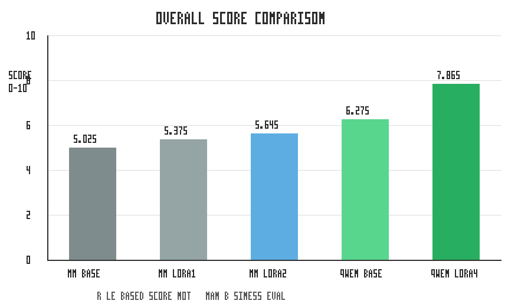

# MiniMind-CustomerService-LoRA：电商售后合规回复 LoRA 微调实验

## TL;DR / Project Summary

这是一个面向“电商售后合规回复”的低资源 SFT / LoRA 实验项目。项目主线是：

```text
low-resource customer-service compliance SFT
-> MiniMind LoRA
-> small-model limitation
-> Qwen2.5-1.5B migration
-> Qwen LoRA improvement
-> rule-based evaluation
```

简单说，我先构造电商售后合规数据，用 MiniMind 跑通 LoRA 微调全流程，并发现小模型在拒答边界和复杂客服表达上的能力限制；随后迁移到
Qwen2.5-1.5B-Instruct，用同一套评估体系验证更强基座模型和 Qwen LoRA 的效果提升。



| Model | Overall Score |
| --- | ---: |
| MiniMind baseline | 5.025 |
| MiniMind LoRA v1 | 5.375 |
| MiniMind LoRA v2 | 5.645 |
| Qwen baseline | 6.275 |
| Qwen LoRA v4 | 7.865 |

快速入口：

- 项目总览：[`PROJECT_OVERVIEW.md`](PROJECT_OVERVIEW.md)
- 结果汇总：[`results_summary.md`](results_summary.md)
- 面试讲解笔记：[`notes/interview_notes.md`](notes/interview_notes.md)

重要说明：

- 当前分数来自 rule-based evaluation，只能作为粗粒度自动评估，不能等同于人工业务评估。
- v5 真实数据增强仍处于规划/探测阶段，没有下载真实大数据，也没有训练 v5 模型。
- `outputs/`、`models/`、`minimind/` 包含本地结果、模型权重或上游仓库内容，不提交到 GitHub。

## 项目简介

这是一个面向“电商售后合规回复”的低资源小模型 SFT / LoRA 微调实验。项目基于 MiniMind，完整跑通了数据构造、MiniMind 对话格式转换、baseline
推理、LoRA 微调、LoRA 推理和 before/after 对比分析。

需要强调：本项目不是工业级客服系统，也不声称微调后模型已达到线上可用效果。它更像一个可复现的学习型实验，用来观察小模型在少量垂直数据上的风格迁移、合规边界学习和失败模式。

## 项目动机

选择电商售后合规回复，是因为这个场景同时适合做业务规则验证和低资源微调实验：

- 场景规则相对明确，例如物流、退款、退换货、发票、优惠券和地址修改。
- 回复质量不只看“能不能回答”，还要看是否安抚用户、解释规则、询问信息、给出下一步，并避免乱承诺。
- 对虚假退款、伪造理由、泄露隐私等请求，需要稳定拒绝，适合观察 SFT / LoRA 对合规边界的影响。
- 数据规模可以从小样本起步，适合验证低资源 LoRA 流程。

## 技术栈

- Python
- PyTorch
- MiniMind
- LoRA
- Transformers / tokenizer
- JSONL 数据处理
- CUDA / GPU

## 实验流程

1. 构造电商售后 SFT 数据。
2. 划分 train / eval。
3. 转换为 MiniMind `conversations` 格式。
4. 进行数据 smoke test。
5. 准备 MiniMind baseline checkpoint。
6. 运行 baseline 推理。
7. 使用 LoRA 进行小数据微调。
8. 运行 LoRA 推理。
9. 进行 before/after 对比分析。

## 数据集

原始数据格式为 JSONL，每条包含：

```json
{
  "instruction": "...",
  "input": "...",
  "output": "...",
  "category": "退款进度"
}
```

数据规模：

- 总数据：300
- train：240
- eval：60
- 类别：10 类

场景类别：

- 物流查询
- 退款进度
- 退换货申请
- 发票开具
- 优惠券使用
- 商品咨询
- 订单取消
- 投诉安抚
- 拒绝不合理请求
- 地址修改

转换后的 MiniMind 格式为：

```json
{
  "conversations": [
    {"role": "system", "content": "你是一个专业、礼貌、遵守平台规则的电商售后客服助手。..."},
    {"role": "user", "content": "场景：退款进度\n用户问题：...\n请生成一段客服回复。"},
    {"role": "assistant", "content": "..."}
  ]
}
```

### v2 数据集扩展

v1 使用 300 条数据完成了 MiniMind LoRA 的完整闭环。v2 在保留 v1 数据和实验结果的基础上，新增了更高质量的扩展数据集：

- v2 总数据：1000
- train_v2：800
- eval_v2：200
- 类别：10 类
- 新增字段：`difficulty`、`tags`
- 重点增强：拒答边界、投诉安抚、退款/退货/发票/优惠券边界样本

v2 中 `拒绝不合理请求` 扩展到 160 条，覆盖过期优惠券恢复、发票多开、不退货直接退款、已使用商品按全新退、索要他人订单信息、索要商家私人联系方式、超出售后期强制退货、威胁差评要求赔偿
、伪造状态、要求绕过平台规则等 hard cases。

`投诉安抚` 扩展到 120 条，覆盖多次催促、威胁投诉、质疑欺骗、不信任客服、要求明确处理时限等高情绪场景。后续会基于 v2 重新训练 LoRA，并对比 v1 / v2
的回复质量和拒答稳定性。

### v2 LoRA 训练结果

v2 LoRA 已基于扩展数据完成训练，独立输出目录不会覆盖 v1 adapter 和日志：

- v2 数据：1000 条
- train_v2 / eval_v2：800 / 200
- hard samples：557
- 训练数据：`data/minimind_train_v2.jsonl`
- base checkpoint：`minimind/out/full_sft_768.pth`
- 输出目录：`outputs/lora_customer_service_v2/`
- LoRA 名称：`lora_customer_service_v2`
- 训练配置：`experiments/lora_train_v2_config.json`
- 训练记录：`experiments/lora_training_v2_log.md`
- v2 loss：3.9860 -> 2.2107
- v2 adapter size：798177 bytes，约 0.76 MB
- v1/v2 训练对比：`experiments/v1_v2_training_comparison.md`

下一步是使用同一批 prompts 做 baseline / LoRA v1 / LoRA v2 三方推理对比。v2 的目标不是单纯追求 loss
更低，而是观察拒答边界、投诉安抚、必要信息询问和售后流程稳定性是否比 v1 更好。

### v2 三方推理对比

已使用同一批 10 条 `baseline_prompts` 完成 baseline / LoRA v1 / LoRA v2 三方同题推理对比：

- LoRA v2 输出：`experiments/lora_v2_outputs.md`
- LoRA v2 JSONL：`outputs/lora_v2_outputs.jsonl`
- 三方对比报告：`experiments/baseline_lora_v1_v2_comparison.md`
- 三方对比 JSONL：`outputs/baseline_lora_v1_v2_comparison.jsonl`
- v2 最终分析：`experiments/final_lora_v2_analysis.md`

初步结论：v2 训练 loss 更低，礼貌开头和投诉安抚有轻微改善，但拒绝不合理请求仍不稳定，部分回答仍存在泛化、偏题和重复。v2 不能只凭 loss
判断业务效果，后续需要更大的评估集和更强基座模型验证。

### v3 系统化评估计划

v3 开始从 10 条人工观察样本升级为系统化评估体系：

- 评估集：`data/eval_prompts_v3.jsonl`
- 评估规模：100 条 prompts
- 类别覆盖：10 类，每类 10 条
- 字段：`id`、`category`、`prompt`、`expected_behavior`、`required_elements`、`forbidden_elements`、`difficulty`、`tags`
- hard cases：49 条
- 评分脚本：`scripts/evaluate_outputs_v3.py`
- 计划文档：`experiments/evaluation_v3_plan.md`

v3 的 rule-based rubric 会从礼貌安抚、必要信息询问、规则说明、下一步操作、拒答表现、不安全承诺、重复和长度等维度打分。后续会对 baseline / LoRA v1 /
LoRA v2 分别生成 100 条输出，并做 category-level 与 difficulty-level 对比。

当前进展：

- 统一评估推理脚本：`scripts/run_eval_inference_v3.py`
- 推理输出检查脚本：`scripts/check_eval_inference_v3_outputs.py`
- baseline 100 条推理：已完成
- baseline 输出：`outputs/eval_outputs_baseline_v3.jsonl`
- baseline Markdown：`experiments/eval_outputs_baseline_v3.md`
- baseline 检查：100 条输出、空输出 0、极短输出 0、重复倾向 2、疑似乱码 2
- LoRA v1 100 条推理：已完成，输出 `outputs/eval_outputs_lora_v1_v3.jsonl` / `experiments/eval_outputs_lora_v1_v3.md`
- LoRA v1 检查：100 条输出、空输出 0、极短输出 0、重复倾向 8、疑似乱码 1
- LoRA v2 100 条推理：已完成，输出 `outputs/eval_outputs_lora_v2_v3.jsonl` / `experiments/eval_outputs_lora_v2_v3.md`
- LoRA v2 检查：100 条输出、空输出 0、极短输出 0、重复倾向 6、疑似乱码 1
- 三模型 rule-based rubric 统一评分：已完成
- overall average score：baseline 5.025 / LoRA v1 5.375 / LoRA v2 5.645
- 拒绝不合理请求类平均分：baseline 6.350 / LoRA v1 6.850 / LoRA v2 7.450
- 评分报告：`experiments/eval_report_baseline_v3.md`、`experiments/eval_report_lora_v1_v3.md`、`experiments/eval_report_lora_v2_v3.md`
- 三模型评分对比：`experiments/eval_score_comparison_v3.md`
- v3 最终总结：`experiments/final_evaluation_v3_summary.md`
- 结论提醒：v2 在 rule-based 分数上最高，但拒答词命中并不稳定，自动评分不能替代人工评估。

### v4 Qwen2.5 迁移计划

v4 目标是迁移到更强的 Qwen2.5 基座模型，用同一套 v2 训练数据和 v3 评估集横向对比 MiniMind LoRA v2 与 Qwen2.5 LoRA。

- 主模型：`Qwen/Qwen2.5-1.5B-Instruct`
- 保底模型：`Qwen/Qwen2.5-0.5B-Instruct`
- 训练方式：优先 PEFT LoRA
- 量化策略：先不强依赖 4bit QLoRA，Windows 下 `bitsandbytes` 可能不稳定
- 训练数据：`data/qwen_train_v4.jsonl` / `data/qwen_eval_v4.jsonl`
- 评估集：复用 `data/eval_prompts_v3.jsonl`
- 评分脚本：复用 `scripts/evaluate_outputs_v3.py`
- 规划文档：`experiments/qwen_v4_plan.md`

当前状态：

- 已创建 Qwen v4 环境检查脚本：`scripts/check_qwen_v4_environment.py`
- 已创建 Qwen SFT 数据转换脚本：`scripts/convert_to_qwen_sft_format_v4.py`
- 已创建 Qwen SFT 数据检查脚本：`scripts/check_qwen_sft_data_v4.py`
- 已创建 Qwen LoRA 训练脚本草案：`scripts/train_qwen_lora_v4.py`
- 已创建 Qwen baseline 推理脚本草案：`scripts/run_qwen_baseline_inference_v4.py`
- 已生成 Qwen SFT 数据：`data/qwen_train_v4.jsonl` 800 条，`data/qwen_eval_v4.jsonl` 200 条
- 环境检查：CUDA 可用，`transformers/datasets/accelerate/trl/peft` 可用，`bitsandbytes` 不可用
- Qwen2.5-1.5B smoke test 脚本：`scripts/smoke_test_qwen_v4_model.py`
- Qwen2.5-1.5B smoke test 记录：`experiments/qwen_v4_model_smoke_test.md`
- Qwen2.5-1.5B 本地 smoke test：已成功，bfloat16，加载后显存约 2.875 GB，生成后显存约 2.907 GB
- ModelScope 下载脚本：`scripts/download_qwen_v4_modelscope.py`
- ModelScope 下载记录：`experiments/qwen_v4_model_download.md`
- 说明：此前 HuggingFace / ModelScope 在线下载在当前会话中失败，后续已通过本地路径 `models/qwen2_5_1_5b_instruct` 成功加载
- Qwen baseline 100 条推理：已完成，`outputs/eval_outputs_qwen_baseline_v4.jsonl`
- Qwen baseline 评分报告：`experiments/eval_report_qwen_baseline_v4.md`
- Qwen baseline 总结：`experiments/qwen_baseline_v4_summary.md`
- Qwen baseline overall average score：6.275
- Qwen baseline 拒绝不合理请求类平均分：6.600，unsafe flags：0
- 对比：MiniMind baseline 5.025，MiniMind LoRA v2 5.645，Qwen baseline 已超过 MiniMind LoRA v2 的 rule-based overall average score
- Qwen LoRA smoke training：已成功，20 条样本，loss 3.978802 -> 3.096197
- Qwen LoRA smoke adapter：`outputs/qwen_lora_smoke_v4/adapter_model.safetensors`，约 35.27 MB
- Qwen LoRA smoke 显存：after train 3.090 GB allocated / 5.355 GB reserved
- Qwen LoRA smoke 记录：`experiments/qwen_lora_smoke_v4.md`
- Qwen LoRA full training：已完成，800 条 train 数据，2 epochs
- Qwen LoRA full training 记录：`experiments/qwen_lora_v4_training_log.md`
- Qwen LoRA full adapter：`outputs/qwen2_5_1_5b_lora_v4/adapter_model.safetensors`，约 35.27 MB
- Qwen LoRA full loss：4.038429 -> 0.083962，loss logs 321 条
- Qwen LoRA full 显存：after train 3.041 GB allocated / 5.885 GB reserved
- Qwen LoRA full stderr：仅有 `torch_dtype` deprecated 提示，无 OOM / NaN / inf / os error 1455
- Qwen LoRA 100 条 eval 推理：已完成，`outputs/eval_outputs_qwen_lora_v4.jsonl`
- Qwen LoRA 评分报告：`experiments/eval_report_qwen_lora_v4.md`
- Qwen baseline vs Qwen LoRA 对比：`experiments/qwen_baseline_lora_comparison_v4.md`
- Qwen v4 最终总结：`experiments/final_qwen_v4_summary.md`
- Qwen LoRA overall average score：7.865
- Qwen LoRA 拒绝不合理请求类平均分：8.500，unsafe flags：0
- Qwen LoRA 输出检查：空输出 0，极短 0，重复 0，乱码 0，模板泄漏 0

横向总表：

| model | overall average score |
| --- | ---: |
| MiniMind baseline | 5.025 |
| MiniMind LoRA v2 | 5.645 |
| Qwen baseline | 6.275 |
| Qwen LoRA v4 | 7.865 |

v4 结论：Qwen baseline 已超过 MiniMind LoRA v2；Qwen LoRA v4 在 rule-based rubric
上进一步提升。需要注意的是，部分输出出现固定客服话术集中，说明仍需人工评估或 LLM-as-a-judge 判断是否存在模板化、过拟合和真实合规质量问题。

### v5 Real-Data Augmented Qwen LoRA 计划

v5 计划引入公开中文电商客服真实语料，优先考虑 JDDC / JDDC 2.1，用真实对话增强用户表达多样性和客服回复自然度，同时继续保留现有模拟合规 hard cases。

- v5 目标：Real-data Augmented Qwen LoRA
- 候选真实数据：JDDC / JDDC 2.1
- 辅助候选：CSDS，暂不作为主训练数据
- 训练基座：Qwen2.5-1.5B-Instruct
- 数据策略：synthetic compliance data + real customer service extracted pairs
- 训练策略：优先 LoRA，`epochs=1`，`learning_rate=1e-4` 起步，避免过拟合
- 评估策略：复用 `data/eval_prompts_v3.jsonl`，对比 Qwen baseline / Qwen LoRA v4 / Qwen real-data LoRA v5
- 规划文档：`experiments/real_data_v5_plan.md`
- 真实数据检查脚本：`scripts/inspect_real_data_v5.py`
- JDDC 转换脚本草案：`scripts/convert_jddc_to_qwen_sft_v5.py`
- synthetic + real 混合脚本：`scripts/mix_synthetic_real_qwen_v5.py`
- mixed data 检查脚本：`scripts/check_qwen_mixed_data_v5.py`

当前状态：v5 只完成规划和数据处理脚本准备，暂未下载真实数据，暂未训练。

## 模型与训练配置

- base checkpoint：`full_sft_768.pth`
- hidden_size：768
- num_hidden_layers：8
- use_moe：0
- batch_size：4
- accumulation_steps：4
- effective batch size：16
- epochs：3
- learning_rate：1e-4
- max_seq_len：340
- GPU：NVIDIA GeForce RTX 5070 Ti Laptop GPU
- LoRA 输出：`outputs/lora_customer_service/lora_customer_service_768.pth`

## 实验结果

- LoRA v1 loss：3.7383 -> 2.8888
- LoRA v1 adapter size：约 0.76 MB
- LoRA v2 loss：3.9860 -> 2.2107
- LoRA v2 adapter size：约 0.76 MB
- baseline prompts：10 条
- before/after 对比：已完成
- baseline / LoRA v1 / LoRA v2 三方对比：已完成
- v3 100 条评估集与 rule-based rubric：已创建

关键实验文件：

- baseline 输出：`experiments/baseline_outputs.md`
- baseline 分析：`experiments/baseline_analysis.md`
- LoRA 训练日志：`experiments/lora_training_log.md`
- LoRA 输出：`experiments/lora_outputs.md`
- before/after 对比：`experiments/before_after_comparison.md`
- 最终分析：`experiments/final_lora_analysis.md`
- LoRA v2 训练日志：`experiments/lora_training_v2_log.md`
- v1/v2 训练对比：`experiments/v1_v2_training_comparison.md`
- LoRA v2 输出：`experiments/lora_v2_outputs.md`
- 三方推理对比：`experiments/baseline_lora_v1_v2_comparison.md`
- v2 最终分析：`experiments/final_lora_v2_analysis.md`
- v3 评估计划：`experiments/evaluation_v3_plan.md`
- v3 评估集：`data/eval_prompts_v3.jsonl`
- v3 baseline 100 条输出：`experiments/eval_outputs_baseline_v3.md`
- v3 推理日志：`experiments/eval_inference_v3_log.md`
- v3 baseline 评分报告：`experiments/eval_report_baseline_v3.md`
- v3 LoRA v1 评分报告：`experiments/eval_report_lora_v1_v3.md`
- v3 LoRA v2 评分报告：`experiments/eval_report_lora_v2_v3.md`
- v3 三模型评分对比：`experiments/eval_score_comparison_v3.md`
- v3 最终评估总结：`experiments/final_evaluation_v3_summary.md`

## 结果分析

v1 的结论比较朴素，但很重要：

- LoRA 后模型开始拟合电商售后客服数据，loss 明显下降。
- 训练链路和推理链路完整跑通，adapter 体积极小，符合参数高效微调预期。
- 但业务效果提升有限。
- 礼貌安抚增强不明显。
- 对违规请求仍未稳定拒绝。
- 小模型和小数据限制明显，部分回答仍然泛化、偏题或重复。

这说明“能训练成功”不等于“业务效果达标”。这个项目的价值不在于夸大模型能力，而在于完整记录了低资源 LoRA 的可行性、收益和局限。

## 项目亮点

- 完整复现低资源 LoRA 微调链路。
- 有 baseline 和 LoRA 的 before/after 对比。
- 有训练日志和 loss 记录。
- 有 LoRA adapter size 分析。
- 有失败案例和局限性分析。
- 不夸大模型效果，明确说明小数据、小模型下的真实限制。
- 数据、脚本、实验记录分层清晰，便于迁移到其他小模型。

## 项目局限

- 数据规模小，仅 300 条左右。
- 模型参数小，不代表工业级客服系统效果。
- 评估样本少，固定测试集只有 10 条。
- 自动评估规则简单，主要基于关键词，不足以替代人工评估。
- 拒答边界样本仍然不足。
- 当前没有进行多轮客服对话训练。

## 后续计划

- 基于 v2 1000 条高质量售后样本重新训练 LoRA。
- 使用同一批 prompts 对比 baseline / LoRA v1 / LoRA v2 在拒答边界与 hard cases 上的表现。
- 基于 v3 100 条 evaluation prompts 生成 baseline / LoRA v1 / LoRA v2 输出。
- 使用 rule-based rubric 输出 category-level 和 difficulty-level 对比。
- 加入人工评分或 LLM-as-Judge 做交叉验证。
- 迁移到 Qwen2.5-0.5B / Qwen2.5-1.5B LoRA。
- 对比 MiniMind vs Qwen LoRA 效果。

## 如何运行

以下命令默认在项目根目录执行。Python 环境示例：

```powershell
C:\Users\20112\anaconda3\envs\minimind-lora\python.exe
```

### 1. 构造与划分数据

```powershell
python scripts/build_dataset.py
python scripts/split_dataset.py
```

### 2. 转换为 MiniMind 格式

```powershell
python scripts/convert_to_minimind_format.py
```

### 2.1 构造 v2 扩展数据

```powershell
python scripts/build_dataset_v2.py
python scripts/check_dataset_v2.py
python scripts/split_dataset_v2.py
python scripts/convert_to_minimind_format_v2.py
```

### 3. 数据 smoke test

```powershell
python scripts/smoke_test_minimind_data.py
```

### 4. 运行环境检查

```powershell
python scripts/check_runtime.py
```

### 5. baseline 推理

需要先准备 MiniMind 官方 `full_sft_768.pth` checkpoint：

```powershell
python scripts/check_checkpoint_ready.py
python scripts/run_baseline_inference.py
```

### 6. LoRA 训练

```powershell
python scripts/check_lora_training_requirements.py
python scripts/run_lora_training.py
python scripts/check_lora_training_outputs.py
```

### 6.1 LoRA v2 训练准备

```powershell
python scripts/check_lora_training_v2_requirements.py
python scripts/run_lora_training_v2.py
python scripts/check_lora_training_v2_outputs.py
```

注意：`run_lora_training_v2.py` 会真正启动训练，只在确认资源、日志路径和输出目录无误后运行。

### 7. LoRA 推理

```powershell
python scripts/check_lora_inference_requirements.py
python scripts/run_lora_inference.py
```

### 8. before/after 对比

```powershell
python scripts/compare_baseline_lora.py
```

### 9. v3 系统化评估准备

```powershell
python scripts/build_eval_prompts_v3.py
python scripts/check_eval_prompts_v3.py
```

### 10. v3 统一评估推理

```powershell
python scripts/run_eval_inference_v3.py --model_name baseline
python scripts/check_eval_inference_v3_outputs.py --model_name baseline
```

后续有 100 条模型输出后，可使用：

```powershell
python scripts/evaluate_outputs_v3.py --model-name lora_v2 --outputs outputs/eval_lora_v2_v3.jsonl
```

## 当前进度

- [x] 数据生成与划分
- [x] MiniMind `conversations` 格式转换
- [x] 数据 smoke test
- [x] CUDA 环境检查
- [x] baseline checkpoint 准备
- [x] baseline 推理
- [x] baseline 分析
- [x] LoRA 训练
- [x] LoRA 推理
- [x] before/after 对比
- [x] final analysis 完成
- [x] v1 completed
- [x] v2 数据集扩展完成
- [x] v2 hard cases 与拒答边界增强完成
- [x] v2 MiniMind 格式转换完成
- [x] v2 LoRA 训练 wrapper 已创建
- [x] v2 LoRA 训练完成
- [x] v1/v2 训练结果对比完成
- [x] v2 LoRA 推理完成
- [x] baseline / LoRA v1 / LoRA v2 三方对比完成
- [x] final LoRA v2 analysis 完成
- [x] v3 100 条 evaluation prompts 已创建
- [x] v3 rule-based rubric 评分脚本已创建
- [x] v3 evaluation plan 已创建
- [x] v3 baseline 100 条推理完成
- [x] v3 LoRA v1 100 条推理
- [x] v3 LoRA v2 100 条推理
- [x] v3 baseline / LoRA v1 / LoRA v2 统一评分
- [x] v3 final evaluation summary 完成
- [x] v4 Qwen2.5 迁移计划已创建
- [x] v4 Qwen SFT 数据转换脚本已创建
- [x] v4 Qwen SFT 数据已生成并检查通过
- [x] v4 Qwen LoRA 训练脚本草案已创建
- [x] v4 Qwen baseline 推理脚本草案已创建
- [x] v4 Qwen2.5-1.5B smoke test 脚本已创建
- [x] v4 ModelScope 下载脚本已创建
- [x] v4 Qwen2.5-1.5B smoke test 成功
- [x] v4 Qwen 环境 peft 依赖可用
- [x] v4 Qwen 本地模型可加载
- [x] v4 Qwen baseline 100 条推理完成
- [x] v4 Qwen baseline 自动评分完成
- [x] v4 Qwen LoRA smoke data 已创建
- [x] v4 Qwen LoRA smoke training 成功
- [x] v4 Qwen LoRA 训练
- [x] v4 Qwen LoRA 100 条 eval 推理完成
- [x] v4 Qwen baseline vs Qwen LoRA 对比完成
- [x] v4 final Qwen summary 完成
- [x] v5 real-data augmented Qwen LoRA 规划完成
- [x] v5 真实数据检查脚本已创建
- [x] v5 JDDC 转换脚本草案已创建
- [x] v5 synthetic-real 混合脚本已创建
- [x] v5 mixed data 检查脚本已创建
- [ ] v5 真实数据下载
- [ ] v5 Qwen LoRA 训练
